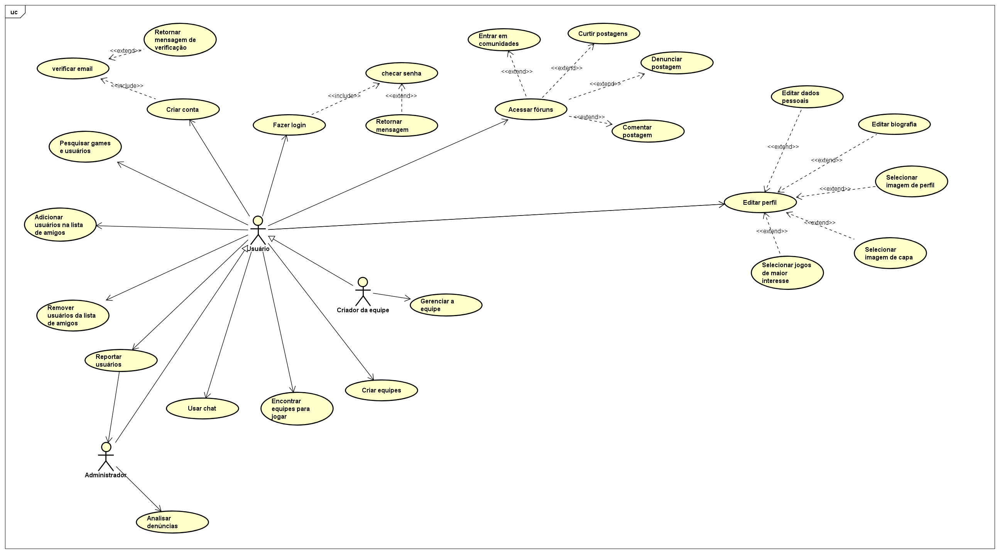

# Especificações do Projeto
O projeto visa criar uma plataforma de rede social dedicada a jogadores, proporcionando um espaço centralizado para compartilhamento de informações sobre jogos, comunicação entre os jogadores, formação de grupos e equipes, e discussões por meio de mensagens diretas e publicações em comunidades. A plataforma será projetada para aprimorar a experiência dos jogadores, facilitando a conexão entre aqueles que possuem interesses comuns.

### Ferramentas utilizadas:
- Discord
https://discord.com/
- Github
https://github.com/
- Figma
https://www.figma.com/
- Visual Studio 
https://visualstudio.microsoft.com/pt-br/
- MySQL
https://www.mysql.com/
- Miro 
https://miro.com/pt/
- Rider
https://www.jetbrains.com/pt-br/rider/features/
- Git Mind
https://gitmind.com/pt/

## Personas

 
 

 
 

 
 

## Histórias de Usuários

Com base na análise das personas forma identificadas as seguintes histórias de usuários:

|EU COMO... `PERSONA`| QUERO/PRECISO ... `FUNCIONALIDADE` |PARA ... `MOTIVO/VALOR`                 |
|--------------------|------------------------------------|----------------------------------------|
|Lucas Soares  | Encontrar ajuda de jogadores.  | Progredir nos jogos e obter mais conquistas.  |
|Lucas Soares  | Encontrar discussões sobre meus jogos favoritos de forma rápida. | Otimizar e aproveitar melhor meu tempo livre.  |
|Manuela Medeiros |Encontrar pessoas para formar equipes. |Evitar jogadores desconhecidos desrespeitosos.  |

## Requisitos

As tabelas que se seguem apresentam os requisitos funcionais e não funcionais que detalham o escopo do projeto.

### Requisitos Funcionais

|ID    | Descrição do Requisito  | Prioridade |
|------|-----------------------------------------|----|
|RF-001| A plataforma deve permitir que o usuário se cadastre. | ALTA | 
|RF-002| A plataforma deve permitir que o usuário faça login. | ALTA |
|RF-003| A plataforma deve possuir um sistema de chat.| ALTA |
|RF-004| A plataforma deve possuir um sistema que permita que o usuário realize publicações. | ALTA |
|RF-005| A plataforma deve possuir um sistema de comunidades. | ALTA | 
|RF-006| A plataforma deve possuir um sistema de formação de equipes e gerenciamento de membros. | ALTA | 
|RF-007| A plataforma deve conter uma ferramenta para adicionar, remover ou bloquear usuários.| ALTA | 
|RF-008| A plataforma deve conter uma ferramenta de pesquisa de usuários ou comunidades. | ALTA | 
|RF-009| A plataforma deve conter uma ferramenta para denunciar usuários, comunidades e postagens. | MÉDIA | 
|RF-010| A plataforma deve permitir que cada usuário possua uma página de perfil editável. | MÉDIA | 

### Requisitos não Funcionais

|ID     | Descrição do Requisito  |Prioridade |
|-------|-------------------------|----|
|RNF-001| O sistema deve ser responsivo para se adaptar a dispositivos móveis. | ALTA | 
|RNF-002| O site deve ser compatível com os principais navegadores do mercado (Google Chrome, Firefox, Microsoft Edge)	|  ALTA | 

## Restrições

O projeto está restrito pelos itens apresentados na tabela a seguir.

|ID| Restrição|
|--|---------------------------------------------------------|
|01| O projeto deverá ser entregue até o final do semestre.|
|02| O projeto deve ser desenvolvido em C#, SQL, JavaScript e .NET.|
|03| O uso do projeto para fins pessoais não é permitido.|
|04| Não deve ser utilizado nenhum framework front-end, exceto Bootstrap.|
|05| Não é permitido utilizar sistemas de IAs generativos para gerar códigos.|

## Diagrama de Casos de Uso

